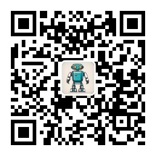

<div align="center">
    <br>
    
    <h1>小伴智能体(代号：ben)</h1>
	<h3>小伴智能体是一款可采用数字人、虚拟人、UE、Live2D、具身硬件为形象的智能体项目</h3>
</div>


小伴智能体（简称ben）是一款可采用数字人、虚拟人、UE、Live2D、具身硬件为形象的智能体项目。我们希望集AI大成为一体，让ben真的具备更强大的智能行为，从而在人们生活中承担角色。ben项目可以作为主播、可以做为家庭教师、可以作为心理医生，可以作为助手。它提供了灵活的模块化设计，使开发人员能够定制和组合各种功能模块，包括情绪分析、NLP处理、语音合成和语音输出等。助理版构建的是一问（远程或本地，移动或PC，语音或文字）一答（数字人或机器，移动或PC，语音或文字或RPA）的标准模式。
                 

## **ben项目规划和目标**


助理版使用：语音沟通，语音和文字回复；文字沟通，文字回复;对接UE、live2d、xuniren，需关闭面板播放。


## **一、模块的组成**


重要：ben（服务端）与数字人（客户端）的通讯接口: [`ws://127.0.0.1:10002`](ws://127.0.0.1:10002)（已接通）

消息格式: 查看 [WebSocket.md](https://github.com/jakciehoo/xiaoban_agent/blob/master/WebSocket.md)


## **二、安装说明**


### **环境** 
- Python 3.9、3.10
- Windows、macos、linux

### **安装依赖**

```shell
pip install -r requirements.txt
```

### **配置应用密钥**
+ 将应用密钥填入 `./system.conf` 中

### **启动**
启动ben控制器
```shell
python main.py
```


## **三、使用说明**


### **使用说明**

+ 语音助理：ben（麦克风输入源开启）；
+ 远程语音助理：ben + 远程设备接入；
+ 数字人互动：ben（麦克风输入源开启、填写性格Q&A）+ 数字人；


### **语音指令**

| 关闭核心                  | 静音                       | 取消静音                                                         |
| ------------------------- | -------------------------- | ------------------------------------------------------------ |
| 关闭、再见、你走吧   | 静音、闭嘴、我想静静        |   取消静音、你在哪呢、你可以说话了                            |


### **联系**

**商务QQ: 308702743**

**交流群及资料教程**关注公众号 **小江智能**（**请先star本仓库**）


